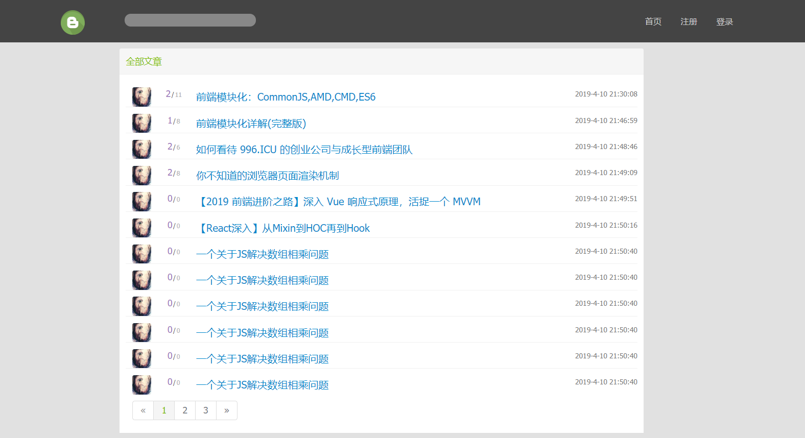
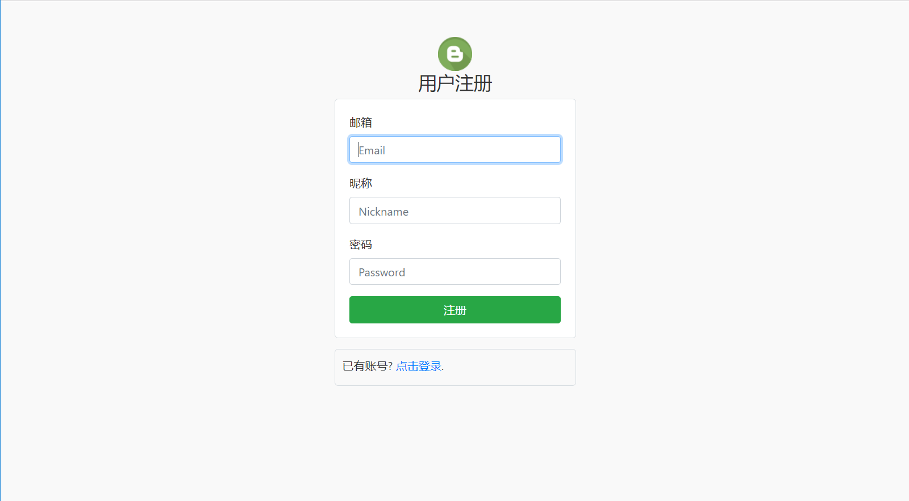
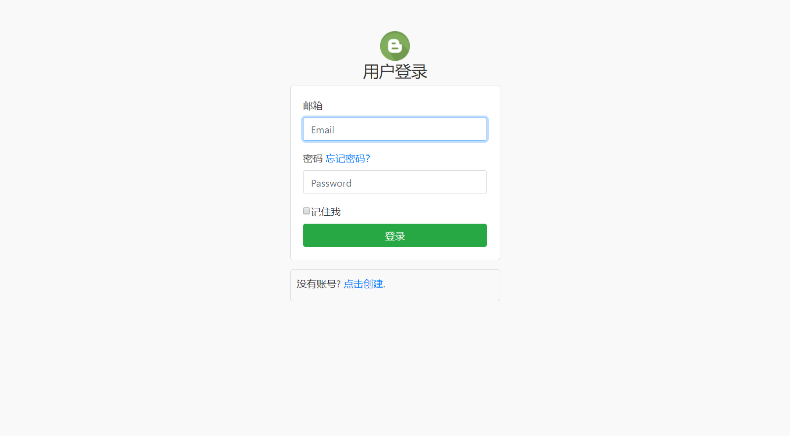
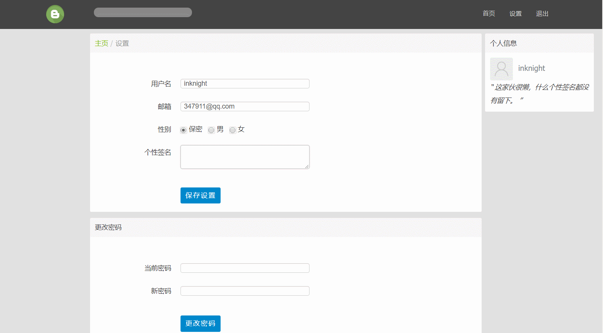
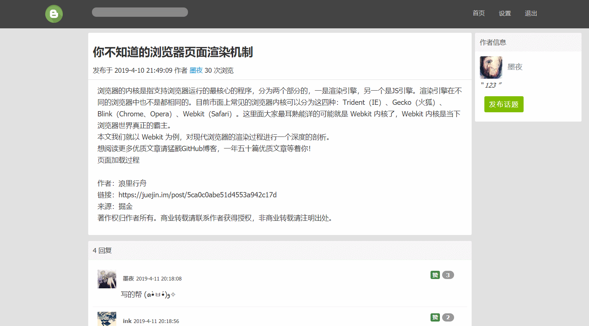

# Express + mongoose + art-template 的简易博客社区

## 开始
需要先安装 [Node.js](https://nodejs.org/zh-cn/download/)、[mongodb](https://www.mongodb.com/download-center/community)、[Graphics Magick](https://sourceforge.net/projects/graphicsmagick/files/latest/download)(头像处理需要)

安装：
```shell
git clone git@github.com:inkn/express-blog-demo.git
```

运行：
1. 启动 mongodb 服务

你只需要在 MongoDB 安装目录的 bin 目录下执行 mongodb 即可

2. 进入项目根目录

```shell
npm install
npm start
```


## 功能描述

- [x] 用户登录、注册、退出
- [x] session保存用户登录状态
- [x] 用户个人信息、密码设置、头像上传
- [x] 首页文章分页展示
- [x] 发表文章
- [x] 查看文章
- [x] 添加评论
- [x] 评论点赞


## 项目截图

### 首页



### 注册



### 登录



### 设置



### 评论



## 使用的其他第三方库
- blueimp-md5 
- body-parser 
- express-session
- multer
- gm
